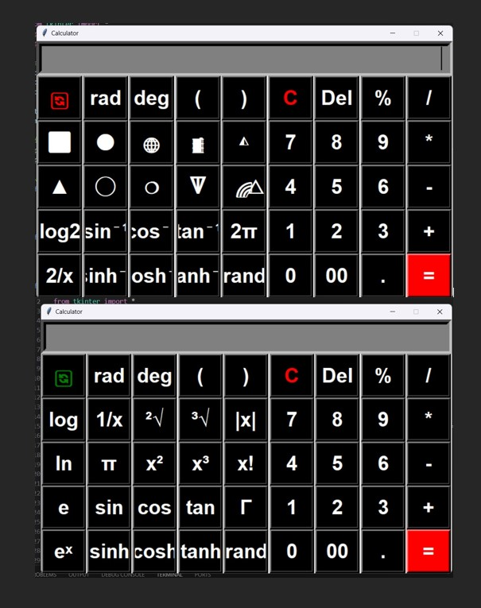

# Scientific Calculator

A scientific calculator application developed with Python and Tkinter.

This is one of my early university projects, created while learning
Python programming, GUI development, and mathematical functions.

## Screenshot



## Features

- Basic arithmetic operations
- Percentage calculation
- Trigonometric functions
- Inverse trigonometric functions
- Hyperbolic functions
- Degree and radian conversion
- Logarithmic functions
- Square and cube calculations
- Square root and cube root
- Factorial and Gamma calculation
- Random number generation
- Geometry calculations
  - Square area
  - Triangle area
  - Circle area and circumference
  - Sphere volume
  - Cylinder volume
  - Cone volume
  - Pyramid volume
  - Prism volume

## Technologies Used

- Python
- Tkinter
- Math module
- Random module

## How to Run

1. Make sure Python is installed on your computer.
2. Download or clone this repository.
3. Run the following command:

```bash
python scientific_calculator.py
